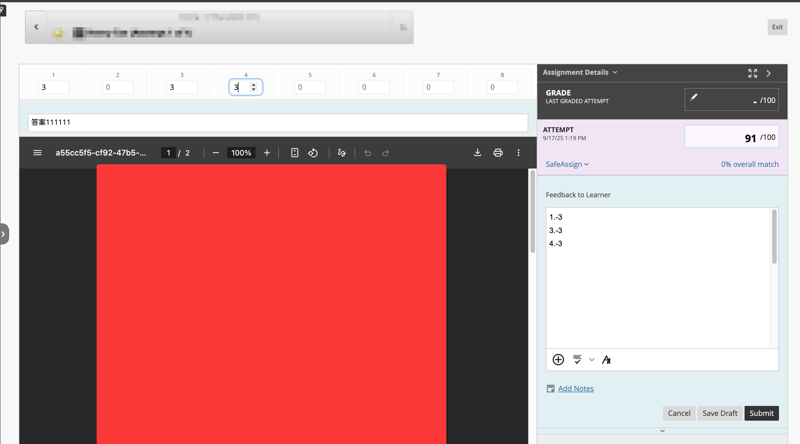

# Blackboard 增强 Pro | Blackboard Enhanced Pro

> Fork from [**Blackboard-Enhanced**](https://github.com/sitdownkevin/Blackboard-Enhanced/tree/main) by [**sitdownkevin**](https://github.com/sitdownkevin)
> 
> Thanks to [**sitdownkevin**](https://github.com/sitdownkevin) for the original script.
>
> Thanks to [**violetctl39**](https://github.com/violetctl39) for the idea of [**DDL Poster**](https://github.com/violetctl39/pibbEnhanced).
> 
> For SCUPI's [**Blackboard - *pibb.scu.edu.cn***]((https://pibb.scu.edu.cn/webapps/login/))
>
> With love from Miang.

## 快速访问

[安装](#安装) | [功能介绍](#功能介绍) | [历史版本](#历史版本)

## 安装

### 1. 在浏览器安装油猴扩展

| 浏览器  |                                                         暴力猴（推荐）                                                          |                                                                   油猴                                                                    |
| :-----: | :-----------------------------------------------------------------------------------------------------------------------------: | :---------------------------------------------------------------------------------------------------------------------------------------: |
| Chrome  |            [安装](https://chrome.google.com/webstore/detail/violentmonkey/jinjaccalgkegednnccohejagnlnfdag?hl=zh-CN)            |                 [安装](https://chrome.google.com/webstore/detail/tampermonkey/dhdgffkkebhmkfjojejmpbldmpobfkfo?hl=zh-CN)                  |
|  Edge   | [安装](https://microsoftedge.microsoft.com/addons/detail/%E6%9A%B4%E5%8A%9B%E7%8C%B4/eeagobfjdenkkddmbclomhiblgggliao?hl=zh-CN) |                  [安装](https://microsoftedge.microsoft.com/addons/detail/tampermonkey/iikmkjmpaadaobahmlepeloendndfphd)                  |
| Firefox |                              [安装](https://addons.mozilla.org/en-US/firefox/addon/violentmonkey/)                              | [安装](https://addons.mozilla.org/en-US/firefox/addon/tampermonkey/?utm_source=addons.mozilla.org&utm_medium=referral&utm_content=search) |

### 2. 安装脚本：

前往 [**GreasyFork**](https://greasyfork.org/zh-CN/scripts/550546-blackboard-%E5%A2%9E%E5%BC%BA-pro-blackboard-enhanced-pro) 安装油猴脚本

### 3. 打开**Blackboard**开始使用

## 功能介绍

### DDL POSTER

#### For Students

- 显示每个作业的截止时间（Due）与倒计时，优先展示未提交的作业；提交后可通过“显示已提交”开关隐藏已提交项。
- 点击 Assignment 标题可直接跳转至 Assignment 提交页面。
- 点击课程标题可进入课程页面。 
- 点击附件按钮可查看 Assignment 附件，便于直接下载作业文档。

#### For Teaching Assistant & Instructor

- 显示每个作业的截止时间（Due）与倒计时，并显示已提交份数（包含重复Attempt）。
- 展示已经批改的作业数与总提交数，便于了解批改进度。
- 点击 Assignment 标题可直接跳转至 Grading 界面。 

- 点击课程标题可进入课程页面。 
- 通过“未批阅”按钮切换为“已批阅”以标记进度；可通过“显示已批阅”开关控制是否展示已批阅的作业。

#### DDL Poster 提供倒计时、可点击跳转与附件查看下载等能力，同时优化样式以提升视觉体验。

### 作业批改

- 扣分统计与自动填分：在“给学习者的反馈”窗口输入扣分情况，格式为在“ - ”后输入扣分数值，脚本会自动识别并将扣分后的成绩填入“尝试”栏中。
- 解决 PDF 不显示问题：优化“BB 不再显示 PDF”功能，提升兼容性与继承程度。
- 解决 PDF 加载失败问题：修复部分浏览器中 PDF 加载失败的问题。
- 新增扣分条：便于记录并可视化各扣分项，统计更直观。
- 备忘录：在批改界面下方新增可本地保存的批注区，可用于记录答案与批改要点，刷新不丢失。
- 布局优化与自动展开：自动展开批改界面、优化信息区分与排版，减少点击并提升可读性。
- 浏览器兼容性与稳定性增强：修复原有显示问题并改进多浏览器适配。

## 变更与优化概览
- DDL Poster
    1. 课程名称可点击跳转至对应课程
    2. 优化样式与视觉体验
    3. 新增倒计时
    4. Assignment 名称直达提交页面
    5. 新增附件查看与下载

- 作业批改
    1. 修复原有界面显示 bug
    2. 新增扣分条
    3. 优化“BB 不再显示 PDF”行为，继承程度更高
    4. 新增扣分统计
    5. 新增批改备忘录
    6. 优化批改界面布局与视觉
    7. 自动展开批改界面
    8. 修复部分浏览器兼容性问题
    9. 提升脚本稳定性

## 免责声明

- 本脚本仅在用户浏览器本地运行，不收集个人敏感信息；请遵守所在学校与平台的使用政策与学术规范。

## 历史版本

### 1.0

优化功能

**DDL Poster**
1. DDL Poster 课程名称可点击跳转至对应课程
2. DDL Poster 优化样式，提升视觉体验
3. DDL Poster 增加倒计时功能
4. DDL Poster 点击Assignment名称可直接跳转至对应作业提交页面
5. DDL Poster 新增附件查看下载功能，下载作业文档更为方便。

**作业批改**
1. 修复原有界面显示bug
2. 新增扣分条，方便记录扣分项
3. 优化BB不再显示PDF功能，继承程度更高
4. 新增扣分统计功能
5. 新增批改备忘录功能，方便记录答案
6. 优化批改界面布局，提升视觉体验
7. 自动展开批改界面，减少点击操作
8. 修复部分浏览器兼容性问题
9. 提升脚本稳定性

### 0.0

Fork自 [**Blackboard-Enhanced**](https://github.com/sitdownkevin/Blackboard-Enhanced) 

代码重构，DDL Poster以fixed的形式出现。